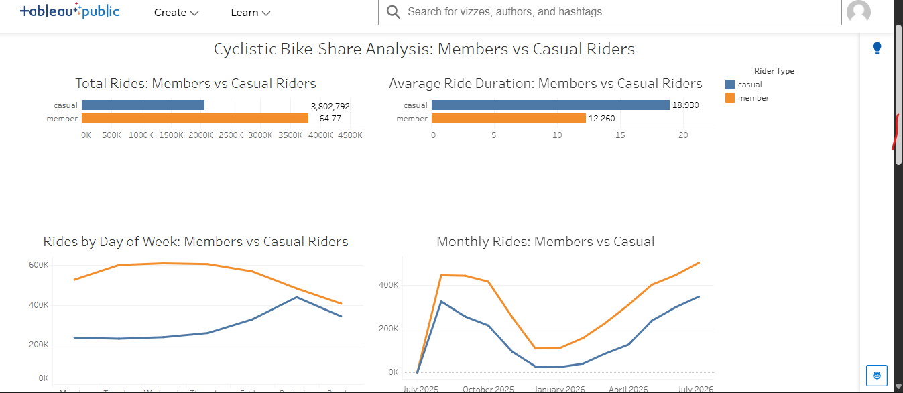
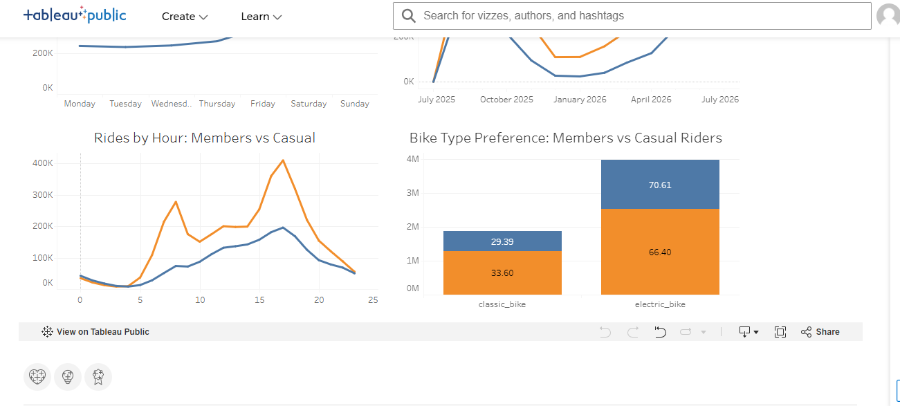

Cyclistic Bike-Share Analysis

Project Overview

This project analyzes Cyclistic bike-share data to compare the behavior of casual riders and annual members.

The goal of the analysis is to identify differences in riding patterns and understand how casual riders and members use the bike-share service.

Tools Used

* SQL — data cleaning, preparation, and analysis
* Tableau — data visualization and dashboard creation

Analysis

The project explores:

* Total rides by rider type
* Average ride duration
* Rides by day of the week
* Monthly ride trends
* Rides by hour of the day
* Bike type preferences

Key Insights

* Annual members account for a larger share of total rides.
* Casual riders have a longer average ride duration.
* Rider behavior varies by day of the week and time of day.
* Bike usage shows clear seasonal patterns throughout the year.
* Casual riders and members show different usage patterns and bike preferences.

Tableau Dashboard

An interactive Tableau dashboard was created to visualize the differences between casual riders and annual members.

View the interactive dashboard on Tableau Public:
[Tableau Public Dashboard] (https://public.tableau.com/app/profile/yana.novytska/viz/CyclisticBike-ShareAnalysis_17871437811940/CyclisticBike-ShareAnalysisMembersvsCasualRiders)

Project Outcome

This project demonstrates my ability to:

* Clean and prepare data using SQL
* Analyze large datasets
* Identify meaningful trends and patterns
* Build clear and effective Tableau visualizations
* Communicate analytical findings through an interactive dashboard
